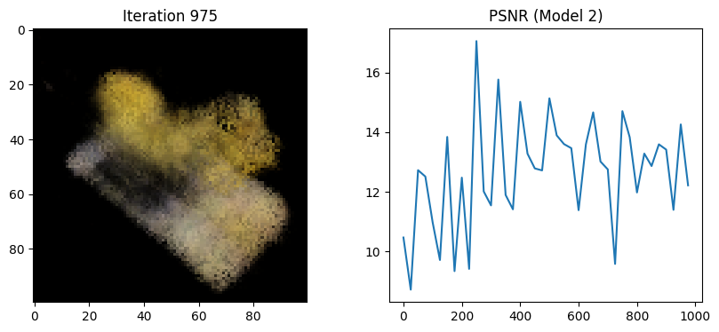

# MeMo NF (Merge Model between Neural Field)

## Preliminaries
### Neural Radiance Field (NeRF)
The Neural Radiance Fields (NeRF) model is a method for synthesizing novel views of complex scenes by directly optimizing a continuous volumetric scene representation. Unlike traditional 3D representation methods, NeRF uses a fully connected (non-convolutional) network, trained to map 5D coordinates to colors. The 5D coordinates contain both spatial location (3D) and viewing direction (2D). This method achieves state-of-the-art results on view synthesis benchmarks and can render high-quality novel views that are consistent with the observed data.

 

### Tiny NeRF
The difference between Tiny NeRF and NeRF is input shape and deepness of the model. In our case, we used 3D coordinates for model inputs dimesion reducted with encoding function. 
We reduced not only input shape, but also model architectures because of complexity. 

 

### Model Merging Method
There are so many Model merging Method.
 1. permutation without activation matching
 2. activation matching considering permutation symmetry 
 3. REPAIR

We applied all above of the Model Merging Methods.

## Experiments
First, we composed Neural Field Models with Tiny NeRF. 
To merge two different model we gave another poses data to each models.
(If there are Model1, Model2, then we used front poses dataset for train Model1 and rear poses datasets for Model2)
Model1 Reconstruction & Model2 Reconstruction

 
 

Base on these models, we can adapt above 3 model merging techniques.
Check codes if you want to know much deeper [./code/Model_merge.ipynb].

### Permutation without activation matching
Permutation without activation matching only consider correlation of latent vectors.

 <video src="./image/merge_2.mp4" width="240" height="240" controls></video>

### Permutation with Activation matching
Permutation with Activation matching consider the activation functions also.

 <video src="./image/merge_1.mp4" width="240" height="240" controls></video>

### REPAIR
REPAIR makes batch-normalization correct.

 <video src="./image/merge_3.mp4" width="240" height="240" controls></video>

